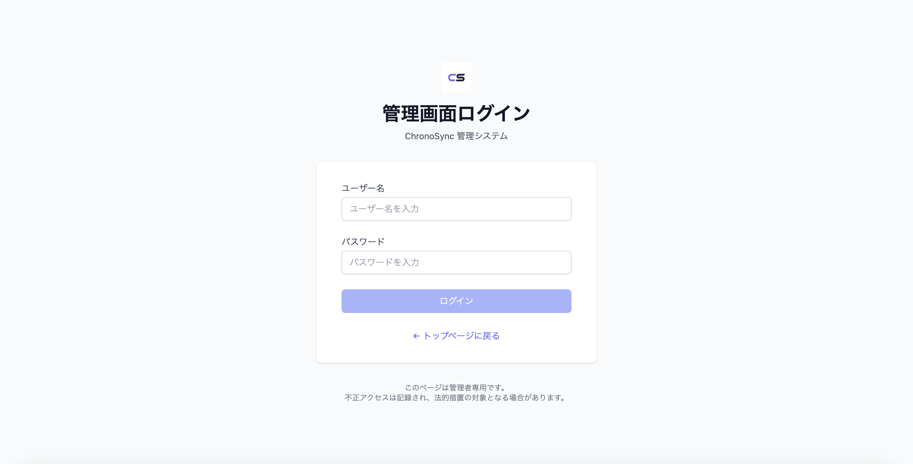
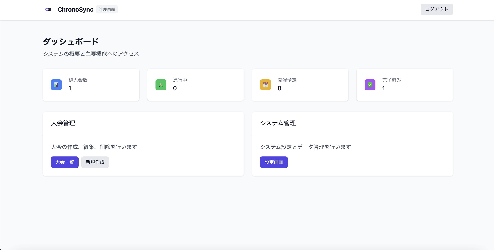
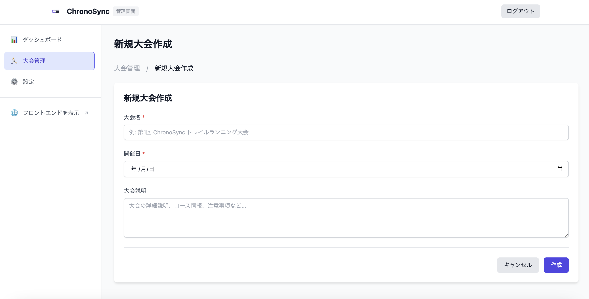
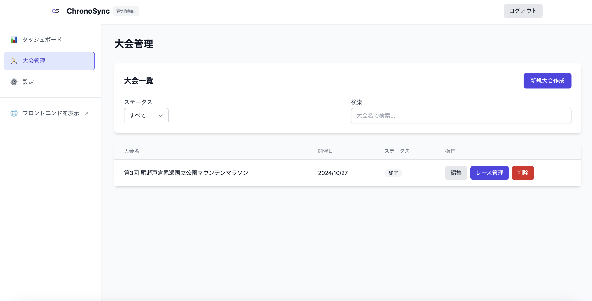
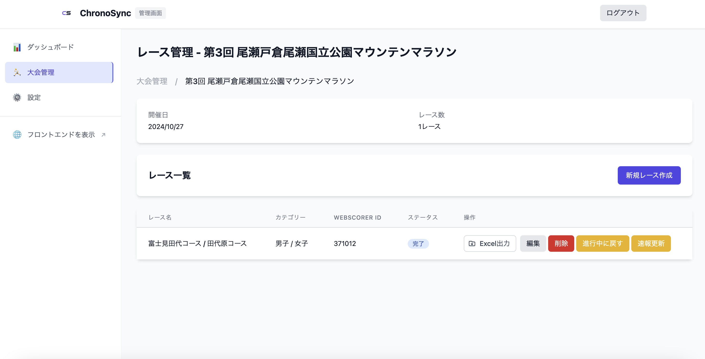
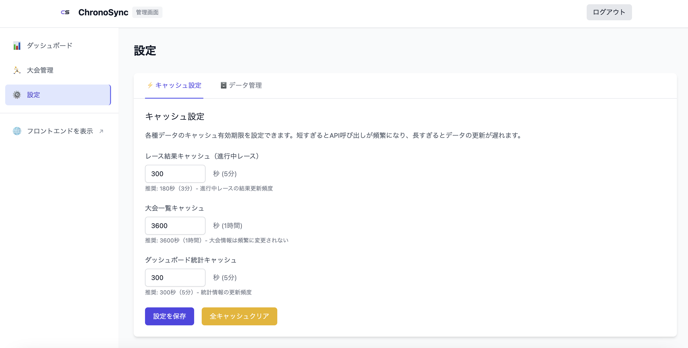

# ChronoSync - リアルタイム速報システム

[ChronoSync](https://chrono-sync.com/) - WebScorer APIと連携したリアルタイム速報プラットフォーム

## 概要

ChronoSyncは、トレイルランニングやスカイランニングなどエンデュランス系の大会向けのリアルタイム速報システムです。WebScorerアプリを使用した手動計測のデータをリアルタイムに取得・表示し、参加者に即時の順位情報を提供します。

### 背景

トレイルランニングやマラソン大会の計測は、通常計測会社に依頼しますが、高額な費用がかかります。そのため、私が関わるの大会ではWebScorerというアプリを使用して手動計測を行っています。計測会社を利用する場合でも、速報サイトは別料金が発生するため、参加者はゴール後もしばらく順位がわからないという課題がありました。

ChronoSyncは、WebScorerのAPIを活用してデータを取得し、見やすく加工して表示することで、この課題を解決します。さらに、スポンサーロゴ掲載機能を備えることで、主催者とスポンサー双方にメリットのあるシステムを実現しています。

## スクリーンショット

### 管理画面

#### ログイン

シンプルで安全な管理者認証を提供します。

#### ダッシュボード

大会とレースの一覧を表示し、各種管理機能にアクセスできます。

#### レース作成

WebScorer Race IDの設定やカテゴリー情報を登録できます。

#### レース一覧

登録されたレースの一覧と各種操作が可能です。

#### カテゴリー管理

レースのカテゴリー設定と参加者の割り当てができます。

#### キャッシュ設定

レースの状況に応じたキャッシュ制御が可能です。

## 主な機能

### 1. リアルタイム速報表示
- カテゴリー別の順位表示
- 詳細な記録情報（タイム、差、年代別順位など）
- レスポンシブデザインによるマルチデバイス対応
- キャッシュ制御
  - レース進行中: 3分間のTTLキャッシュ
  - レース完了後: 30日間の長期キャッシュ
  - 手動更新機能で即時反映も可能
screenshot
### 2. Excel出力機能
- カテゴリー別の結果出力
- 会場での掲示用フォーマット
- カスタマイズ可能なレイアウト

### 3. スポンサー管理
- スポンサーロゴの表示
- クリック計測機能
- 露出効果の分析

## キャッシュ戦略

ChronoSyncは、APIプロバイダーへの負荷を最小限に抑えるキャッシュ制御をしています：

### キャッシュ制御
- **レース進行中**
  - 3分間のTTLキャッシュ
  - 手動更新ボタンで即時更新可能
  - SWRによるクライアントサイドキャッシュ

- **レース完了後**
  - 30日間の長期キャッシュ
  - データの永続性を確保
  - ストレージコストの最適化

### 更新制御
- オンデマンド方式の採用
- 必要なときのみAPIを呼び出し
- バックグラウンド更新の抑制

## 利用の流れ

1. **大会設定**
   - 管理画面で大会を作成
   - 基本情報（大会名、日時、場所など）を設定
   - スポンサー情報を登録（オプション）

2. **レース設定**
   - 大会内にレースを作成
   - カテゴリー情報を設定
   - WebScorer Race IDを登録
   - キャッシュ設定のカスタマイズ（オプション）

3. **速報表示**
   - 参加者がURLにアクセス
   - リアルタイムで順位を確認
   - カテゴリー別に結果を表示
   - 必要に応じて手動更新

4. **結果出力**
   - 必要に応じてExcel形式で出力
   - 会場での掲示用に印刷
   - カテゴリー別に整理された結果を活用

## 技術スタック

- **フロントエンド**: Next.js + TypeScript
- **スタイリング**: Tailwind CSS
- **データストア**: 
  - 速報データ: Redis on Vercel KV
  - スポンサー情報: microCMS
- **デプロイ**: Vercel
- **API連携**: 
  - WebScorer API
  - microCMS API
